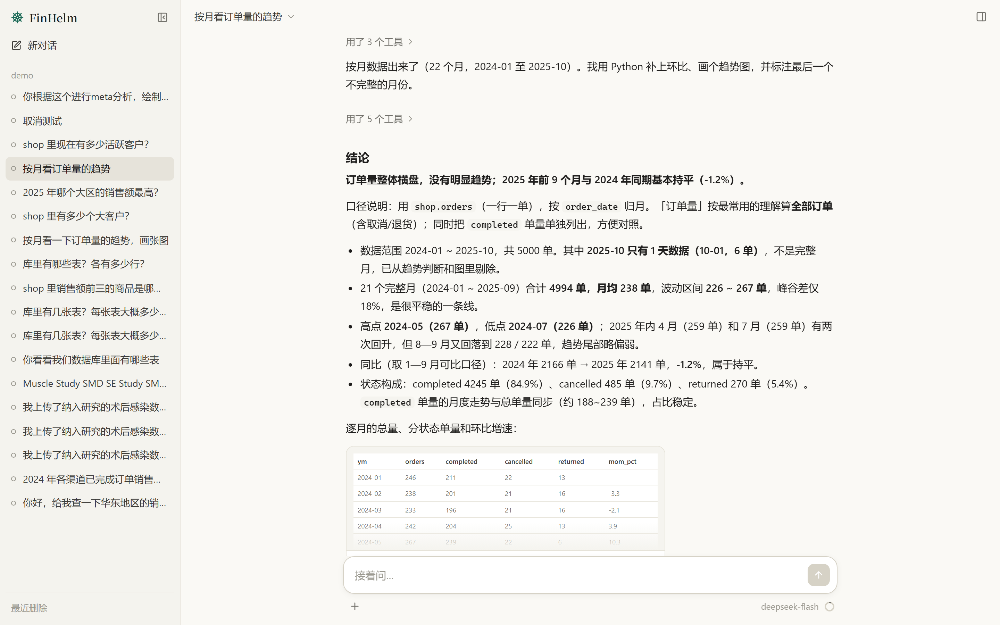
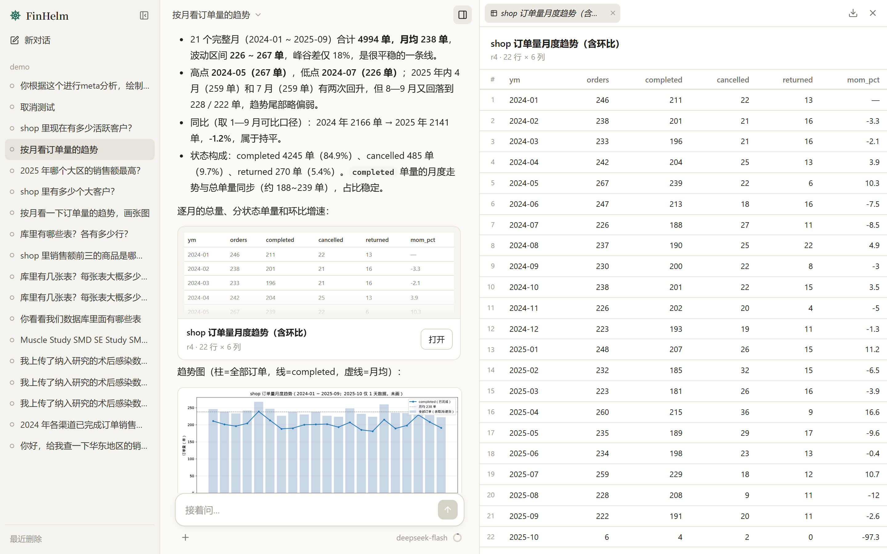

# FinHelm

**面向金融数据分析的通用 Agent**：连数据库取数、在沙箱里用 Python / R 做统计和画图、从财报 PDF 里检索数字，
跨会话记住你的口径。从零手写，不依赖 LangChain 等 Agent 框架；每个功能都用评测证明它有用。




<details>
<summary>右侧结果面板：查询结果、图表、下载 CSV</summary>



</details>

---

## 评测成绩

模型都是 DeepSeek V4.1 Flash。完整的分数变化过程见 **[docs/evaluation.md](docs/evaluation.md)**。

| 评测 | 考什么 | 成绩 |
|:--|:--|:--|
| [DABstep](https://huggingface.co/spaces/adyen/DABstep) 官方排行榜，450 题 | 读业务手册、用 Python 逐笔算支付手续费 | **71.78%**（Hard 69.31%） |
| [BIRD Mini-Dev](https://github.com/bird-bench/mini_dev) financial，官方 EX | text-to-SQL，捷克银行真实数据 | **42.7%**（GPT-4 基线 35.8%，题量不同、不完全可比） |
| [FinanceBench](https://github.com/patronus-ai/financebench) 端到端，50 道数值题 | 368 份美股财报 PDF 里找数、算指标 | **96%** |
| 医学 meta 分析，12 题 × 3 | 上传杂乱 Excel，按 RevMan 5 口径合并效应量 | **100%** |
| 多轮会话，32 轮 × 2 | 上下文清理、压缩之后还答得对吗 | **100%** |

几个改动带来的变化：DABstep dev 30% → 77%（按行读手册、规则约定、步数收尾），BIRD 官方 EX 14.6% → 42.7%（提交轮），
FinanceBench 检索 hit@5 30% → 76%（结构化分片 + 混合检索 + 重排），多轮会话每段输入 token 124 万 → 46 万（大结果编号引用）。

---

## 功能

| | |
|:--|:--|
| **数据库取数** | `list_tables` / `describe_table` / `run_sql`，表和列的注释就是业务说明。三道防线：只放行单条 SELECT、只读事务 + 超时、数据库账号本身没有写权限 |
| **Python / R 沙箱** | 代码跑在断网、只读、限内存的 Docker 容器里，内核常驻、变量跨调用保留；`load_result("r3")` 直接拿到 SQL 结果，数字不经过模型的手 |
| **医学 meta 分析** | R 模板对齐 RevMan 5（效应量、合并方法、森林图、偏倚风险图、漏斗图、敏感性分析），模型负责读懂杂乱表格、翻译参数、解释结果 |
| **财报知识库（RAG）** | 手写版面分析（表格按列对齐）、按章节结构分片、BM25 + bge-m3 向量 + 重排、增量索引；做成工具让模型自己决定搜什么、搜几次 |
| **长期记忆** | 跨会话记住口径、偏好和纠正；一条一个 Markdown 文件，项目级 / 用户级两层，矛盾时有明确的优先级，拿不准就问 |
| **Skills、AGENTS.md** | 项目约定写在工作目录的 `AGENTS.md`；换一份数据也成立的做法写成技能，按需加载（[Agent Skills](https://agentskills.io/specification) 规范） |
| **MCP** | 手写 stdio 客户端接外部工具（参数校验、首次调用审批、描述当不可信输入）；知识库本身也是一个 MCP 服务器 |
| **长对话** | 旧工具结果换成占位、历史写成滚动摘要、写摘要复用 prompt 缓存；API 报超长时强制整理再重试 |
| **断了接着跑** | 一轮是事务、失败回滚；进度另存成检查点，限流、断网、按了停止之后从断的地方继续 |
| **中途提问** | 口径有几种理解、结果差很多时停下来问，给选项；回答作为那次工具调用的结果，同一轮接着做 |
| **子 Agent（可选）** | `delegate` 把查探、独立的子问题分派给上下文全新的子 Agent，几个同时跑、各用各的沙箱，只交回结论；可选交付前复核。评测下来在现有数据上不值得默认开，默认关 |
| **两种界面** | 终端（逐字输出）和 Web（布局参考 Claude desktop，结果面板、可以停止正在跑的工具、会话管理、多账号） |

---

## 快速开始

需要 Python 3.12、Docker；Web 界面还要 Node 18+。模型支持 OpenAI 兼容接口（DeepSeek、通义、Kimi、vLLM 等）和 Anthropic。

```bash
pip install -r requirements.txt
cp .env.example .env                     # 填模型的 key，其余默认就能跑

docker compose -f docker/docker-compose.yml up -d        # Postgres + 示例数据（电商、银行）
docker build -t finhelm-sandbox docker/sandbox           # Python 沙箱
docker build -t finhelm-sandbox-r docker/sandbox-r       # R 沙箱（做 meta 分析才要）
```

**终端**：

```bash
python run.py                  # 新对话
python run.py --resume         # 接着上次的对话（也可以 --resume <会话ID>）
```

**Web 界面**：

```bash
cd web && npm install && npm run build && cd ..
python run_web.py              # 打开 http://127.0.0.1:8765
```

可以先问这些：

- 2025 年哪个大区销售额最高？给我前三名和占比
- 按月看订单量的趋势，画张图
- （上传 Excel）帮我做 meta 分析，画 RevMan 格式的森林图，按手术类型做亚组分析

没有 Docker 时在 `.env` 里设 `PYTHON_SANDBOX=false`、`R_SANDBOX=false`，只剩 SQL 工具；不连库就把 `DATABASE_URL` 留空。

---

## 使用

### 终端命令

| 命令 | 作用 |
|:--|:--|
| `/attach 文件…` | 上传文件（复制进会话目录，沙箱里能读） |
| `/continue [一句话]` | 接着跑暂停、出错的那一轮，可以加一句话调整方向 |
| `/save [r3] [文件名]` | 把查询结果存成 CSV |
| `/context`、`/compact` | 看上下文用量、手动压缩 |
| `/skills`、`/skill:名字 要做的事` | 看有哪些技能、指定按某个技能做 |
| `/memory`、`/mcp`、`/tools`、`/tables` | 看长期记忆、MCP 服务器、工具、库里的表 |
| `/reset`、`/exit` | 清空对话、退出 |

### Web 界面

左边会话列表（改名、删除、「最近删除」里恢复），中间对话，右边是结果面板。思考和工具调用默认收成一行，点开看每一步的 SQL、代码和结果；
回答里引用的结果表和画的图是预览卡片，点开在面板里看全部行、下载 CSV。点停止会连正在跑的工具一起停（沙箱杀内核、SQL 取消查询）。

没有账号时是单用户，只许本机访问。要给别人用：

```bash
python run_web.py adduser alice                 # 建账号（输入密码），之后要登录
python run_web.py --host 0.0.0.0                # 有账号才允许对外监听
```

每个账号的会话、长期记忆分开存。会话数据在 `sessions/<会话ID>/`，终端和 Web 读的是同一份，
数据都存在哪、怎么备份见 [设计说明](docs/design.md#web-界面)。

### 用在自己的数据上

只有一个 Agent，不分场景，能做什么只看环境里配了什么：

| 想要 | 怎么配 |
|:--|:--|
| 连自己的库 | `DATABASE_URL`（建议只读账号），`DB_SCHEMA` 只看某个 schema |
| 告诉它数据是什么、口径怎么算 | 项目目录（`PROJECT_DIR`）下写 `AGENTS.md`，原样拼进系统提示词 |
| 给沙箱一个只读数据目录 | `DATA_DIR`，容器里是 `/data/` |
| 检索一批 PDF | `DOCS_DIRS`，几个目录用 `;` 隔开，一个目录一个知识库 |
| 接外部工具 | 项目目录下放 `.mcp.json`（格式同 Claude Code） |
| 固定的分析流程 | `<PROJECT_DIR>/.agents/skills/<名字>/SKILL.md` |

---

## 配置

全部在 `.env`（参考 [.env.example](.env.example)）。常用的：

| 变量 | 默认 | 说明 |
|:--|:--|:--|
| `PROVIDER` | `openai` | `openai`（兼容接口）或 `anthropic` |
| `OPENAI_BASE_URL` / `OPENAI_MODEL` | DeepSeek / `deepseek-flash` | 换厂商换这两个 |
| `OPENAI_CONTEXT_WINDOW` | 1000000 | 上下文窗口，决定什么时候整理 |
| `OPENAI_VISION` | `true` | 模型能不能看图，不能就不注册 `view_image` |
| `DATABASE_URL` | 本地示例库 | 留空 = 不连库 |
| `PROJECT_DIR` | `examples/demo` | 读这里的 `AGENTS.md`、`.mcp.json`、技能 |
| `PYTHON_SANDBOX` / `R_SANDBOX` | `true` | 沙箱开关 |
| `DOCS_DIRS` | 空 | 知识库目录 |
| `MEMORY_ENABLED` / `MEMORY_DIR` | `true` / `~/.finhelm` | 长期记忆 |
| `ASK_USER` | `true` | 中途提问；批处理设成 `false` |
| `SUBAGENTS` / `VERIFY` | `false` / `false` | 子 Agent；交付前复核（要开着子 Agent） |
| `MAX_STEPS` | 12 | 一轮最多几步，用完时根据已有结果收尾 |
| `STREAM` | `true` | 逐字输出 |
| `SESSIONS_DIR` / `WEB_DIR` | `sessions` / `~/.finhelm/web` | 会话记录、Web 账号 |

---

## 架构

```
          终端（cli.py）      Web（FastAPI + SSE ⇄ React）      评测（evals/）
                 └───────────────┬──────────────────────┘
                          订阅事件，读 agent.state
                                 │
                   app.py：唯一知道零件怎么拼的地方
                                 │
      ┌─────────────┬────────────┼─────────────┬──────────────┬──────────┐
    llm/          tools/       rag/          mcp/          memory      session/
  各家模型      SQL、沙箱、   知识库检索    外部工具       长期记忆     会话落盘
                读文件…
      └─────────────┴────────────┼─────────────┴──────────────┴──────────┘
                                 ▼
             core/：主循环、消息、工具接口、事件、运行状态、上下文管理
                   （不 import 包外任何模块，测试守着这条规则）
```

几条贯穿全局的设计：

- **core 只定义接口**（`LLMProvider`、`Tool`、`BaseContext`），实现都在外面。所以主循环能塞个假模型完整测一遍，换厂商只动 `llm/`。
- **运行和展示解耦**：主循环只发事件（开始一轮、流式的一小段、调工具、整理上下文…），终端、Web、评测各自订阅；
  界面要的状态从事件折叠出来（`state = reduce(state, event)`，学 [pi](https://github.com/earendil-works/pi) 的 AgentState）。
- **上下文是只追加的**：清理、压缩都作为标记追加，不改原消息；一轮失败整轮回滚，进度另存检查点。
- **一个工具结果两个读者**：模型拿够推理的预览，界面拿完整数据（`ToolOutput.content` / `details`）；大结果编号引用，回答里写 `{{r3}}`。

每一块为什么这么写、参考了谁、踩过什么坑，见 **[docs/design.md](docs/design.md)**。

```
src/data_agent/
├── core/        主循环 agent.py、消息、工具框架、事件、运行状态、上下文管理（清理 / 压缩）
├── llm/         OpenAI 兼容、Anthropic（格式转换、流式、超长报错识别）
├── tools/       sql/、python/、r/（沙箱内核 + RevMan 模板）、read_file、view_image、ask_user、记忆、知识库
├── rag/         版面分析、分片、BM25、向量、重排、增量索引
├── mcp/         stdio 客户端、知识库 MCP 服务器
├── session/     会话日志、检查点
├── web/         FastAPI 后端、账号
├── app.py       组装
└── cli.py       终端
web/             React + Vite 前端
evals/           题库、判分器、公开评测的接入（BIRD、DABstep、FinanceBench）
tests/           700 多个单元测试，不需要 key 和数据库
```

---

## 测试

```bash
pytest                         # 不需要 key 和数据库；沙箱相关的没有 Docker 镜像就跳过
```

想看明白内部怎么转，`docs/` 里有几个可以直接跑的小脚本：一次提问背后发了几次请求、工具为什么每轮都要重发、
真实的 HTTP 请求体长什么样（`what_is_in_context.py`、`why_tools_resent.py`、`raw_http_body.py`）。

---

## 路线图

已完成：主循环与工具框架 → 上下文管理（清理、压缩、缓存）→ 评测框架与公开评测 → Python / R 沙箱 → 轮内检查点 →
Skills → 长期记忆 → 中途提问 → RAG → MCP → 运行状态与流式输出 → Web 界面 → 子 Agent 与交付前复核。

子 Agent 在 DABstep dev 上的对照：模型不需要分派（主上下文最大 7～8 万 token）；复核 27 次只改对 1 次、准确率不变、花费 ×1.8，
所以默认关（[详细记录](docs/evaluation.md#多-agent子-agent-和交付前复核)）。
可能的下一步：让复核用另一个模型（同一个模型错得一样），以及判定「结论成不成立」而不只核对数字。

---

## 参考

- [earendil-works/pi](https://github.com/earendil-works/pi)：分层、事件与状态、会话日志、工具结果的 content / details
- Claude Code：上下文压缩、检查点、AskUserQuestion、auto memory、MCP 配置格式
- [Docling](https://github.com/docling-project/docling) / [Unstructured](https://github.com/Unstructured-IO/unstructured)：文档元素模型、按结构分片
- 评测：[DABstep](https://huggingface.co/spaces/adyen/DABstep)、[BIRD Mini-Dev](https://github.com/bird-bench/mini_dev)、[FinanceBench](https://github.com/patronus-ai/financebench)

## 许可证

MIT，见 [LICENSE](LICENSE)。DABstep 的判分代码和测试（`evals/dabstep/scorer.py`、`tests/test_dabstep_scorer.py`）是 CC BY 4.0；
meta 分析评测的原始数据来自 metafor / meta 包收录的已发表研究，出处见 `evals/cases/gen_research.py`。
