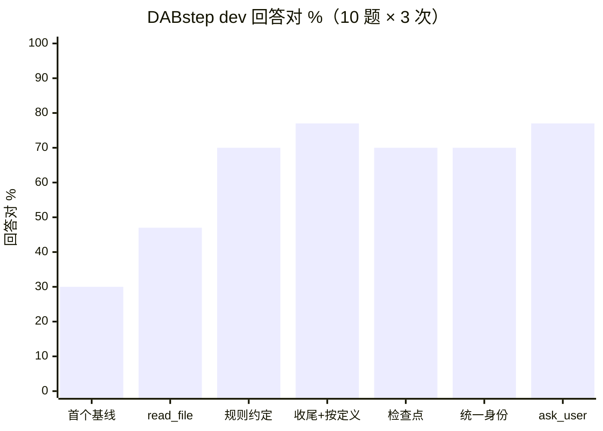
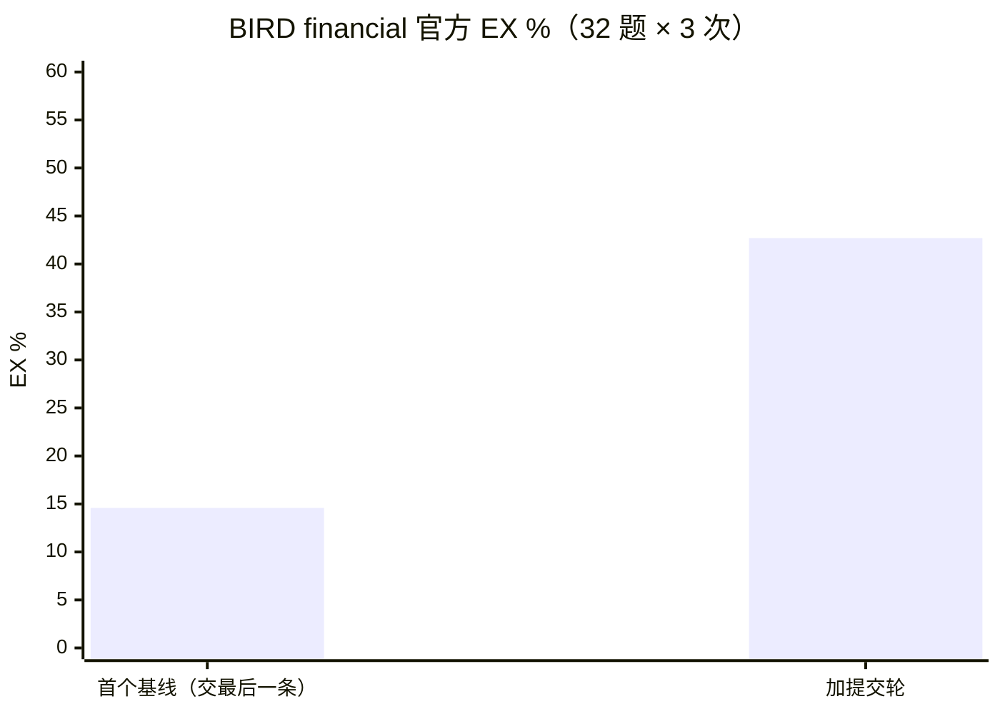
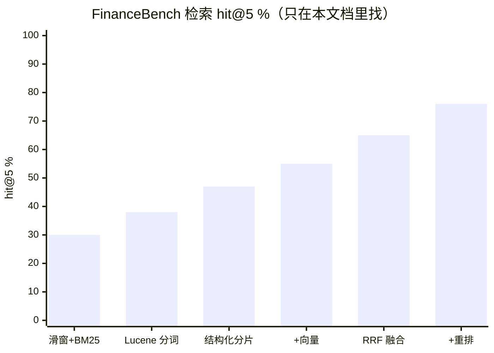

# FinHelm 评测

单元测试回答「代码有没有按设计运行」（假模型、几秒跑完）；评测回答「Agent 能不能把活干好」
（真模型、要花钱，改提示词、换模型、改策略时手动跑）。判分器是手写的，每条规则都有单元测试；
每次运行记下 git 版本、模型、提示词和题库的指纹，运行记录在 `evals/runs/`（不进 git）。

- [当前成绩](#当前成绩)
- [分数变化过程](#分数变化过程)
- [各题库的变化](#各题库的变化)
- [怎么跑、怎么判](#怎么跑怎么判)
- [详细记录](#详细记录)

所有分数都是同一个模型：**DeepSeek V4.1 Flash**（2026-09-25 之前走阿里云百炼端点，叫 `deepseek-v4.1-flash`；
之后大多走 DeepSeek 官方端点，叫 `deepseek-flash`，是同一个模型）。不另外说明时，一题跑 3 次，分数是 pass@1（跑一次答对的概率）。

---

## 当前成绩

| 题库 | 考什么 | 规模 | 成绩 |
|:--|:--|:--|:--|
| [DABstep](https://huggingface.co/spaces/adyen/DABstep) 官方排行榜 | 读 2.2 万字的业务手册、用 Python 逐笔算支付手续费 | 450 题 | **71.78%**（Easy 84.72%，Hard 69.31%） |
| DABstep dev（本地判分） | 同上，有答案的 10 题 | 10 × 3 | 70%–77% |
| BIRD Mini-Dev financial（官方 EX） | text-to-SQL，捷克银行真实数据 | 32 × 3 | **42.7%**（GPT-4 在 Mini-Dev PG 上 35.8%） |
| FinanceBench 端到端 | 368 份美股财报 PDF 里找数、算指标 | 50 题 | **96%**（Agentic RAG、查询改写都是 48/50） |
| FinanceBench 检索 | 证据页在前 5 片里（只在本文档 / 368 份全库） | 150 题 | hit@5 **76%** / **54%** |
| 医学 meta 分析（research） | 上传杂乱 Excel，按 RevMan 5 口径合并效应量 | 12 × 3 | **100%** |
| 电商取数（shop） | 自建 20 道 SQL 分析题 | 20 × 3 | 95%–98% |
| 多轮会话（shop_multi） | 十几轮对话，中间清理、压缩上下文之后还答得对吗 | 3 段 × 32 轮 | **100%** |
| 长期记忆（memory） | 跨会话沿用口径、偏好，记忆矛盾时怎么定 | 10 段 × 3 | **100%** |
| 中途提问（ask） | 该问的问、不该问的不问 | 6 × 3 | **100%** |

---

## 分数变化过程

按时间排。「运行」列是 `evals/runs/` 下的目录名（时间戳 + 标签），可以对回原始报告。

| 日期 | 改了什么 | 题库 | 分数变化 | 运行 |
|:--|:--|:--|:--|:--|
| 09-24 | 评测框架 + 电商 20 题 | shop | 回答对 **100%**（首跑 90%，是判分器把「先查答案、最后查明细」判错了，改成看所有 SQL） | 152833 |
| 09-24 | 报告加缓存命中率 | shop | 97%，缓存命中 72% | 233958 |
| 09-24 | 多轮会话题库（填充轮撑大上下文，逼出清理和压缩） | shop_multi | 14 个判分轮全对；缓存 87%，清理后那次 43%、压缩后 8% | 002658 |
| 09-25 | 换 DeepSeek 官方端点；清理节奏三组对照 | shop_multi | 三组都是 96%，未命中 token 打平 → 维持现状 | 011105 等 |
| 09-25 | 写摘要改成原样发对话 + 追加要求（复用缓存） | shop_multi | 96% → **100%**；写摘要命中 27% → 99%，未命中 −35% | 012901 / 012903 |
| 09-25 | 输出上限 8192 → 32768、判分容差按精度 | shop_multi | 100%，缓存 91% | 015613 |
| 09-25 | 加「查不到只能靠记住」的回忆题 | shop_multi | 32/32，查不到的 4/4（压缩 1~2 次后仍记得） | 122159 |
| 09-25 | run_sql 结果编号 r1…，大结果只给模型预览 | shop / shop_multi | 都是 100%；每段输入 124 万 → **46 万** token、249s → 87s、缓存 97% | 124354 / 124355 |
| 09-25 | 多轮门槛降到清理 8000 / 压缩 1.2 万 | shop_multi | 100%，每段在回忆前整理 1~3 次，缓存 94% | 130738 |
| 09-25 | 接入 BIRD financial | bird | 主分数 53%（重判后回答对 75%）；**官方 EX 14.6%** | 142306 |
| 09-25 | 提交轮：答完再交一条只含所问列的 SQL | bird | **官方 EX 14.6% → 42.7%**（按值比 52%） | 145835 |
| 09-25 | view_image 看自己画的图 | shop | 开 98% / 关 97%（持平，功能在 research 上用） | 233403 / 233642 |
| 09-26 | 医学科研题库（杂乱 Excel + RevMan 5 口径） | research | 首个基线 **94%**，pass^3 83%（2 次步数耗尽） | 000501 |
| 09-26 | 接入 DABstep | dabstep_dev | 首个基线 **30%**，pass^3 10%，30 次里 10 次步数耗尽 | 012009 |
| 09-26 | `read_file` 按行读手册 | dabstep_dev | 30% → **47%**，步数耗尽 10 → 2；40 步 50%（不值得） | 013959 |
| 09-26 | 手册里规则匹配的约定写进项目说明 | dabstep_dev | 47% → 70%（单次） | 021129 |
| 09-27 | 步数用完时收尾、「有定义按定义」 | dabstep_dev / research / bird | dabstep_dev **77%**、research **100%**；bird 回答对 74% 持平、提交轮按值比 52% → 46%（代价） | 1457 / 1530 / 1545 |
| 09-27 | DABstep 450 题正式提交 | dabstep | **71.78%**（Hard 69.31%） | 145416 + 补跑 |
| 09-27 | 轮内检查点（中途断了接着跑） | dabstep_dev | 70%；注入 10% 的 API 错误后仍 70%、逐题相同，省下 70% 的输入 token | 171834 / 175643 |
| 09-29 | 一个 Agent 不分场景，项目约定来自 AGENTS.md | 五套 | shop 98%、shop_multi 96%、bird 71% / 50%、research 100%、dabstep_dev 70%（无回归） | 1137xx |
| 09-29 | Skills（meta 分析流程拆成技能） | research | 100% 不变；系统提示词 1753 → 1127 字符 | 122109 |
| 09-29 | 长期记忆 | memory | 关记忆 39% → 开记忆 **94%**（修正一个判分正则后 18/18） | 130855 |
| 09-29 | `ask_user` 中途提问 | ask | 关 61% → 开 **83%**；该问 6/9、不该问 0/9 | 133959 |
| 09-29 | 同上，其余题库回归 | 六套 | shop 95%、shop_multi 100%、memory 100%、research 97%、bird 69% / 47%、dabstep_dev 77% | 1339xx |
| 09-29 | 记忆冲突规则（这次 / 以后、项目级优先、矛盾就问） | memory | 10 段会话 **100%**，记忆文件检查 45/45 | 140339 |
| 09-29 | 歧义原则改成「差很多就问」 | ask | 83% → **100%**，该问 9/9 | 141303 |
| 09-29 | RAG 检索：BM25 → 结构化分片 → 向量 → 融合 → 重排 | financebench 检索 | 本文档 hit@5 **30% → 76%**；全库 10% → 54% | 1555 ~ 1632 |
| 09-29 | 端到端：六种给模型看文档的做法 | financebench | 传统 RAG 80%、全库 76% → 查询改写 **96%**、Agentic **96%** | 192705 |
| 09-29 | 解析器 v3（表头不再当标题） | financebench | 证据因修复变化的题只升不降（+3）；单次运行波动 ±4 题 | 231824 |
| 09-30 | 知识库改走 MCP | financebench | 原生 96% = MCP 96%，逐题对错相同 | 235118 |
| 09-30 | 多 Agent：子 Agent（`delegate`）+ 交付前复核（`verifier`） | dabstep_dev | 关 73%；开子 Agent 10 次里 0 次分派；开复核 73%，27 次复核改对 1、改错 0，输入 token ×1.8、耗时 ×1.6 → **默认关** | 142121 / 143144 / 144004 |

运行状态、流式输出、Web 界面不改变请求内容（评测里强制关流式），没有单独重跑评测。

---

## 各题库的变化

### DABstep



| 阶段 | 回答对 | pass^3 | 步数耗尽 | 平均步数 |
|:--|--:|--:|--:|--:|
| 首个基线（25 步） | 30% | 10% | 10 / 30 | 16.0 |
| 加 `read_file` | 47% | 30% | 2 / 30 | 12.6 |
| 规则约定（单次） | 70% | — | 1 / 10 | 12.5 |
| 收尾 + 「有定义按定义」 | 77% | 70% | 0 | 11.2 |
| 严格参数 + 原地打转 + 检查点 | 70% | 70% | 0 | 11.2 |
| 多 Agent 对照的基线（09-30，全关） | 73% | 60% | 0（3 次收尾） | 11.5 |
| 开子 Agent + 交付前复核 | 73% | 70% | 0（3 次收尾） | 13.0 |

最后几组在 70% 和 77% 之间来回，全部来自 dab-49 一道题（「欺诈最多的国家」按笔数还是按手册的欺诈率定义，模型两种都会选），
其余 9 题每次结果都一样。每题 3 次、一题摇摆就是 ±6.7 个点，dev 分数按 70%–77% 看。

正式集 450 题：首轮 25 步答出 349 题、答对 273（首轮单独算 60.7%）；没交出答案的 101 题用 40 步 + 收尾补跑、答对 50。
合计 323 / 450 = **71.78%**。

### BIRD Mini-Dev financial



| | simple | moderate | challenging | 总 |
|:--|--:|--:|--:|--:|
| 首个基线（交最后一条 SQL） | 11.1% | 19.7% | 0% | 14.6% |
| 加提交轮 | 66.7% | 47.0% | 19.1% | **42.7%** |

提交轮没改 Agent 本身：回答真人时它会多给几列上下文、把数 ROUND 好看，按 BIRD「结果集合完全一样」的规则算错。
答完追问一句「交一条只返回所问列的 SQL」，这一条按 BIRD 判。42.7% 和「按值比」的 52% 差的 9 次全是 float / Decimal 类型不同。
之后 BIRD 只做回归（主分数回答对一直在 69%–75%），不为它调。

### FinanceBench



| 端到端（50 道数值题） | 告诉文档 | 答对 | 平均输入 token |
|:--|:-:|--:|--:|
| 整份 10-K 放进上下文 | 是 | 96% | 141k |
| 直接给证据页（上限） | 是 | 96% | 1.3k |
| 传统 RAG（题目原文检索一次） | 是 | 80% | 3.0k |
| 传统 RAG，368 份全库 | 否 | 76% | 3.0k |
| 查询改写（先出检索计划再检索） | 否 | **96%** | 3.7k |
| Agentic RAG（自己决定搜什么、搜几次） | 否 | **96%** | 24.9k |
| Agentic RAG，知识库走 MCP | 否 | 96% | 23.5k |

### 医学科研（research）

| 阶段 | 回答对 | pass^3 | 说明 |
|:--|--:|--:|:--|
| 首个基线 | 94% | 83% | 2 次步数耗尽：反复修自己画的图；钻牛角尖手算 τ² |
| 加步数收尾 | 100% | 100% | 收尾触发 2 次，都答对 |
| 统一身份（AGENTS.md） | 100% | 100% | |
| Skills（流程拆成技能） | 100% | 100% | 系统提示词短了 35%，每题输入 8.1 万 → 9.2 万 token（技能正文进上下文） |
| ask_user 回归 | 97% | 92% | 问了 1 次：rs-12 数据写成「151/5」（事件数超过人数） |

### 电商取数（shop）与多轮会话（shop_multi）

两套自建题库一直在 95%–100%，只用来防退步。多轮会话更有价值的是成本：

| 多轮会话（每段） | 输入 token | 未命中 | 耗时 | 缓存命中 |
|:--|--:|--:|--:|--:|
| 多轮基线（百炼端点） | 105 万 | — | 7 分钟 | 87% |
| 官方端点，结果编号之前 | 124 万 | 9.3 万 | 249s | 92% |
| 结果编号、大结果只给预览 | **46 万** | **1.2 万** | **87s** | **97%** |

### 长期记忆（memory）与中途提问（ask）

| | 关 | 开 |
|:--|--:|--:|
| memory：跨会话沿用口径 | 39% | 94% → 100%（加记忆冲突规则后 10 段会话，记忆文件检查 45/45） |
| ask：口径没定义时问不问 | 61% | 83% → 100%（歧义原则改成「差很多就问」） |

---

## 怎么跑、怎么判

```bash
python -m evals.run --cases shop                       # 默认每题 3 次，4 路并发
python -m evals.run --cases shop_multi --trials 2
python -m evals.run --cases research                   # 要 Docker 和 R 镜像
python -m evals.run --cases dabstep_dev                # 先 python -m evals.dabstep.prepare 下载数据
python -m evals.run --cases bird_financial             # 先 python -m evals.bird.prepare 导数据
python -m evals.run --cases memory
python -m evals.run --cases ask
python -m evals.financebench.retrieval                 # 只测检索，不调大模型
python -m evals.financebench.e2e                       # 端到端，几种做法并排比

python -m evals.run --only shop-003 --trials 1         # 只跑某几题
python -m evals.run --model qwen3.6-flash              # 换个模型比一比
python -m evals.run --set max_steps=40 --label 40步     # 临时改一项配置，打个标签
python -m evals.run --inject-errors 0.1                # 按概率注入 API 错误，测断了接着跑
python -m evals.run --regrade evals/runs/<目录>         # 改了判分规则，用存下的 SQL 和回答重判，不重跑模型
```

每次运行生成 `evals/runs/<时间>_<题库>_<模型>_<标签>/report.md`：分数、步数、token、缓存命中率、按标签的准确率、
失败分类，以及和上一次运行的逐题对比。

**怎么判**（`evals/graders.py`，每条规则都有单元测试）：

| 判分项 | 规则 |
|---|---|
| 结果对 | Agent 跑过的 SQL 里，有一条查出了标准答案（重跑它，和标准 SQL 的结果比）。不管顺序、列名；多几列、比例乘了 100、NULL 显示成「未填写」都算对 |
| 严格 | 而且列数也一样（接近 BIRD 的判法） |
| **回答对** | 结果对，而且标准答案里的数字在最终回答里都说到了（「810.05 万」「33.2%」这类写法都认） |
| 　兜底 | SQL 没对上，但标准答案只有一个算出来的数（比例、平均数）、回答里说到了（比如在回答里自己算的增长率），也算回答对，报告里单独列出。整数（ID、个数）不兜底：第一版认过，真跑出了误判 —— 标准答案的账户号只是在候选表里出现过 |

和 BIRD 官方判法的区别：BIRD 只看**最后一条** SQL、要求结果完全一样。冒烟测试里 3 道 Agent 答对的题
按那种判法会全错 —— 它先查出答案，最后又查一条明细给你对比口径。跑 BIRD 时两种分数都报。

**看什么**：pass@1（跑一次答对的概率）、pass^k（连跑 k 次都对的题占比，看稳不稳）、
平均步数 / token / 耗时、按标签分类的准确率、失败分类，以及和上一次运行的逐题对比。
每次运行记下 git 版本、模型、提示词和题库的指纹 —— 分数离开这些就说不清是什么条件下跑出来的。

---

## 详细记录

每套题库的原始分析：失败归因、对照实验、踩过的判分坑。

### 电商取数（shop）

**基线**（2026-09-24，deepseek-v4.1-flash，20 题 × 3 次）：回答对 **100%**，pass^3 100%，
严格只有 35%（Agent 几乎总会顺手多给几列，比如订单数），平均 3.3 步、13.6 秒、输入约 6.4k token。
60 次里有 21 次是靠**不是最后一条**的 SQL 对上的 —— 按 BIRD 只看最后一条的判法，这些都会被判错。

⚠️ 100% 说明这 20 道题对这个模型**太简单了**：它只能防退步，量不出改进。下一步要加难题
（BIRD 的 financial 库、更刁钻的口径；多轮 + 压缩后追问见下一节）。

已知局限：回答核对只查「该说的数说没说」，不查「有没有多说错的」—— 比如问「超过 16 个」
却把正好 16 个的也列进去，结果核对可能照样通过。目前靠抽查运行记录兜底。

### 多轮会话：清理、压缩之后还答得对吗

```bash
python -m evals.run --cases shop_multi --trials 2    # 3 段会话，每段 14~19 轮
```

单题都是短对话，上下文管理一次都不会触发。`shop_multi` 让同一个 Agent 连着回答十几轮：
**填充轮**（列清单，不判分）把上下文撑大，逼出清理和压缩；**回忆轮**（`match: answer`，只看回答里的数）
问前面算过的结果；还有依赖前文的追问和「第一轮定的口径，压缩后还守不守」。
题目由 `evals/cases/gen_shop_multi.py` 生成。

门槛按真实配置的比例缩小，写在每段会话的 `settings` 里。缩多少看单个工具结果多大 ——
结果不跟着缩，门槛太低会一来结果就清，缓存数字失真。起初结果约 4k token，用 3 万 / 4.5 万（1 万时一轮连清 5 次）；
run_sql 只给预览之后结果最多约 1.5k，改成清理 8000 / 压缩 1.2 万（1 万 / 1.5 万试过，触发太晚，回忆轮大多在整理之前）。

报告多出：每段会话清理 / 压缩了几次、在第几轮；回忆轮重查了几次；缓存命中率另拆出
**清理后**、**压缩后**那一次调用 —— 历史被改，缓存就断在改动的位置。

**基线**（2026-09-25，6da696b，deepseek-v4.1-flash，3 段 × 2 次）：14 个判分轮全对，回忆 8 次全对（6 次重查）。
每段约 105 万输入 token、7 分钟。缓存命中 87%；清理后那次调用 43%，压缩后 8%。
没命中的 token 里 55% 是每步新增的内容（躲不掉），**34% 是清理 / 压缩造成的** —— 第 5 步要省的就是这部分。
（之后给 B、C 两段各加了 3 条填充，保证每次都会压缩，下次要重跑基线。）

**第 5 步的两个实验**（2026-09-25，改用 DeepSeek 官方端点）：
- 清理节奏：「现状 / 只清大结果 + 低水位 / 不清理」三组准确率一样，未命中的 token 打平；
  不清理的总输入多 17%，算上缓存价反而更贵 —— 清理的收益在于之后每次请求都少带一截。维持现状。
- 写摘要：原样发对话、末尾追加「请写摘要」（学 Claude Code），替代序列化成文本（学 pi）。
  写摘要命中 27% → 99%，每段会话未命中 13.9 万 → 9.1 万（−35%），一份摘要的输出 5.8k → 1.6k token；
  准确率、回忆、口径约定都没掉。序列化的写法已删掉。
- 收尾：Anthropic 那一路开了缓存（系统提示词断点 + 顶层自动缓存，未实测）；输出上限 8192 → 32768
  （思考 token 算输出，列上百行清单会被截断）；判分器的数值容差改成按写出来的精度算
  （固定 0.005 对 5% 量级的比例太宽）；「各渠道退货率」写明全部年份。

**第 5 步之后的基线**（2026-09-25，f203a3b，DeepSeek 官方 deepseek-flash，3 段 × 2 次）：
28 个判分轮全对，回忆 8/8（全部重查）；每段约 119 万输入 token、4.4 分钟，缓存命中 91%，
清理后那次调用 35%、压缩后 10%、写摘要 99%。

**加了查不到的回忆题**（2026-09-25，6fe7055，同上配置）：前面的回忆题 Agent 都靠重新查答对，
测不出摘要记没记住。B、C 两段各加一道：用户在开头口头给个目标（「比 2024 年增长 12%」「线上毛利率目标 35%」），
末尾让按这个目标算 —— 数据库里没有，只能靠上下文 / 摘要。4 次全对，都是压缩 1~2 次之后（滚动摘要也没丢）。
32 个判分轮全对，缓存命中 92%。报告新增「一轮里整理 ≥ 2 次」：0 / 110 轮。
连着几轮都清理（如第 13~16 轮各清一次）是填充轮每轮加 2 万多、门槛只有 3 万，每轮都该清，不是同一轮反复整理。

**大结果在源头处理**（2026-09-25，7b89220 / 933bf98 / b8f64d0）：一个工具结果两个读者（学 pi 的 content / details）——
模型要够推理的最少信息，用户要完整数据。run_sql 的结果编号 r1、r2…：20 行以内原样给模型，更多只给前 10 行；
完整结果（≤1 万行）走 `details` 给界面。模型要别的行就改 SQL 再查（只读查询重跑是同一份数据，
所以不像 pi 那样要翻页工具）。回答里写 `{{r3}}`，界面在那个位置展示整张表，模型不用逐行抄。评测按展开后的回答判分。
文件只在用户要的时候写：终端 `/save`（默认最近的结果，`/save r3 [文件名]` 指定），或者在对话里说「导出」（`export_csv` 工具），两边都按编号重跑当时的 SQL。
编号和结果存在 `tools/sql/results.py` 的结果仓库里，只有一份（以前 CLI、run_sql、评测各存一份）。它不放进对话历史：
历史一轮失败就整轮回滚，但那一轮的结果用户已经看到了，还可能 `/save` —— 仓库记的是「用户见过什么」，只增不减。
（pi、Claude Code 自动把大结果存进临时 / 会话目录，那是给**模型**回头翻的 —— 它们的输出只有一份；
我们的数据能重查，不需要为模型落盘。以后接结果不能重拿的工具再做，见「下一步扩展」。）

| DeepSeek 官方 deepseek-flash | 改前 | 改后 |
|:--|--:|--:|
| 单题库回答对（20 题 × 3） | 100% | 100% |
| 单题库平均输出 token | 944 | 769 |
| 多轮回答对（32 轮） | 100% | 100% |
| 填充轮（列清单）平均输出 token | 4,679 | 502（73/78 轮用了引用） |
| 每段会话输入 token / 其中未命中 | 124 万 / 9.3 万 | 46 万 / 1.2 万 |
| 每段会话耗时 | 249s | 87s |
| 上下文峰值 | 4~7 万 | 1.4~2.2 万 |
| 缓存命中 | 92% | 97% |

副作用：上下文再也涨不到评测门槛（清理 3 万），清理 / 压缩一次都没触发 —— 多轮评测门槛随后降到 8000 / 1.2 万（见上文）。
回忆轮重查从 12/12 降到 6/12：小结果整份留在上下文里，模型直接用。

**当前多轮基线**（2026-09-25，门槛 8000 / 1.2 万，runs/20260925-130738「门槛8000」）：32/32 全对，查不到的回忆 4/4；
每段都在回忆轮之前清理或压缩 1~3 次；每段 36 万输入 token、92s，缓存 94%（清理后 25%、压缩后 26%、写摘要 95%）。
这次发现判分器把「多一行合计」（Agent 用 ROLLUP）判成行数不对，改成去掉唯一一行文字标签是合计的行再比，重判了存档。

### 医学科研：上传文件的题（research）

```bash
python -m evals.run --cases research --trials 3      # 12 道题，要 Docker 和 R 镜像
python evals/cases/gen_research.py                   # 改题之后重新生成 Excel、标准答案和题库
```

**数据是真的**：7 个 metafor / meta 包收录的已发表 meta 分析（BCG 疫苗、抗菌导管、卒中单元、被动吸烟、静脉镁剂…），
原样导出在 `evals/cases/research/source/`。**文件是乱的**：生成脚本把它们做成用户真会上传的那种 Excel ——
标题行、两行合并表头、「4/123」「55±47」「1.18 (0.90–1.54)」写在一格里、给的是标准误不是标准差、中间空行、表底合计行。

**标准答案不用模板算**：`research/gold.R` 直接调 meta 包的 RevMan 5 设置。`fh_` 模板是被考的对象，不能自己给自己判分。
BCG 那题的 RR 0.49（0.34–0.70）、I² 92% 和教科书一致。

| 题型 | 判分 |
|---|---|
| 合并效应、CI、I²、亚组、敏感性分析 | `gold_values`：每个数回答里都要说到。容差按回答写到几位算，不看正负号（「少住 14 天」算说到了 −13.98） |
| 该用的模板（通用倒方差、带偏倚风险的森林图） | `expect_code`：沙箱代码里要出现 `fh_meta_gen(`、`fh_forest(..., rob =` |
| 数据有错（Heard 1998 写成 151/5） | `expect_text`：回答里要点名这项研究、说出问题，不能自己改数 |
| 自己画图 | `expect_figure`；另外统计「自己画了图之后有没有 `view_image` 看一眼」，不计分 |

每个 trial 有自己的工作目录（`运行目录/work/<题>-<次>/`），图留着，失败时能直接看。步数耗尽、出错的不算对。

**首个基线**（2026-09-26，deepseek-flash，12 题 × 3 次，max_steps 20）：回答对 **94%**，pass^3 83%，
平均 12 步、53 秒、8.2 万输入 token（缓存 92%）。两次失败都是步数耗尽：一次反复修自己画的图；
一次已经指出了 Heard 1998 的错，又去手算 τ² = 0 时 M-H 固定效应和随机效应为什么不一样（RevMan 的随机效应用倒方差权重，本来就不一样）。
自己画图的 4 个 trial 里 3 个交付前看了图。标准误陷阱 3/3 都换算对了，还发现了源数据里一个方差异常小的研究。

**加了步数收尾之后**（2026-09-27，百炼端点）：回答对 **100%**、pass^3 100%。收尾触发 2 次、都答对了 ——
用的是默认的保守收尾（`report`），不引导模型去猜，它照样能根据已有结果把题答对。

### DABstep：支付数据多步分析（公开评测）

[DABstep](https://huggingface.co/spaces/adyen/DABstep) 是 Adyen 出的数据分析 Agent 评测：13.8 万笔支付交易、
1000 条手续费规则、商户资料和一份业务手册，考「读懂文档里的规则，再用代码逐笔算」—— SQL 做不了，考的是 Python 沙箱。

```bash
python -m evals.dabstep.prepare                         # 下载数据到 data/dabstep/（不进 git），生成两个题库
python -m evals.run --cases dabstep_dev --trials 3      # 10 道有答案的题，本地判分
python -m evals.run --cases dabstep --trials 1          # 450 道正式题，答案不公开
python -m evals.dabstep.submission <运行目录>            # 导出排行榜要的 submission.jsonl，去排行榜网页手动提交
```

- **项目 `evals/projects/payments`**：不连数据库，只有 Python 沙箱。数据文件只读挂进容器的 `/data/`（设置里的 `data_dir`），不往每个 trial 复制。
  约定里只写文件是什么、先读手册，不写任何题的口径。
- **答题格式**：题目原文后面附官方的格式要求，让模型最后一行写「最终答案：…」，评测只看这一行。
- **判分**：官方的 `question_scorer` 原样拷贝在 `evals/dabstep/scorer.py`（官方的测试也一起搬了过来，保证和排行榜一致）。
- 450 道正式题的答案不公开。数据集里有别人的提交和逐题得分，理论上能反推出答案，但那等于绕过它故意隐藏的测试集，不这么做。

**首个基线**（2026-09-26，deepseek-flash，dev 10 题 × 3 次，max_steps 25）：回答对 **30%**，pass^3 10%，
平均 16 步、97 秒、25 万输入 token（缓存 95%）。**30 次里 10 次步数耗尽**：手册有 2.2 万字符，工具结果上限 6000，
模型得分段读，每道题开头光读文档、逛数据就花掉约 10 步。答错的两类：算出了手册定义的指标却按常识下结论
（「欺诈最多」手册定义是金额占比，它按笔数选了）；手册里没有的概念（「高欺诈罚款」）不答 Not Applicable，自己编一个解释。

**加 `read_file` 之后**（同一天，同样配置）：回答对 **47%**、pass^3 30%，步数耗尽 10 → 2 次，平均 12.6 步。
同时试了 40 步：50%（多对 1 次，噪声范围内），输入 token 却多 60%，剩下的步数耗尽 40 步也做不完 —— 维持 25 步。

**之后两处改动**：错题分析发现规则匹配理解错了（规则里 null 或空列表表示「全部适用」；一笔交易要同时满足一条规则的全部条件，
不能按字段分开查），写进 payments 约定；另一类是算出了手册定义的指标、却按常识下结论，提示词从「歧义按最常见口径」
改成「有定义按定义」。再加上步数用完时的收尾：

| dev（10 题 × 3 次） | 回答对 | pass^3 | 步数耗尽 |
|:--|--:|--:|--:|
| 首个基线 | 30% | 10% | 10 |
| 加 `read_file` | 47% | 30% | 2 |
| 加规则约定、「有定义按定义」、收尾（2026-09-27，百炼端点） | **77%** | 70% | 0（收尾 4 次） |
| 同上 + 严格参数、原地打转、轮内检查点（2026-09-27，再跑一组） | **70%** | 70% | 0（收尾 2 次） |

最后两组相差 7 个点，全部来自 dab-49 一道题（2/3 → 0/3），其余 9 题每次结果都一样：这题问「欺诈最多的国家」，
按笔数和按手册的欺诈率定义答案不同，模型两种都会选。新加的三样在这 30 次里一次都没触发（没有参数错误、没有重复调用、
没有 API 报错），所以这是模型本身的摇摆，不是改动的影响。每题 3 次、一题摇摆就是 ±6.7 个点，dev 分数按 70%–77% 看。

剩下的错集中在三道题：dab-70 问手册里没有的「高欺诈罚款」（该答 Not Applicable），dab-2697 题意有分歧，都不追；dab-49 见上。

**正式集**（450 题，提交到[排行榜](https://huggingface.co/spaces/adyen/DABstep)）：**71.78%**，Easy 84.72%，Hard 69.31%。
构成要说清楚：首轮 25 步答出 349 题，答对 273（首轮单独算 60.7%）；没交出答案的 101 题用 40 步 + 收尾补跑
（`submission.py` 合并多个运行目录，只按「有没有写出答案」选，不看对错），答对 50；其中被强制收尾的 25 题答对 11 ——
交兜底那句话的话，这 11 分就没了。补跑的一部分走的是 DeepSeek 官方端点（同一个模型）。

### 多 Agent：子 Agent 和交付前复核

子 Agent 是主 Agent 的一个工具 `delegate`：把任务交给上下文全新的子 Agent，它做完只交回结论（设计见 [design.md](design.md#多-agent子-agent)）。
内置三种：`explore`（只读查探）、`analyst`（全部数据工具）、`verifier`（复核）。
复核做成机制（`VERIFY`）：主 Agent 第一次打算交答案时推它一句，先派 `verifier` 独立重算，再给最终回答。
这样评测能拿到「复核前」「复核后」两版答案，都按同样的规则判分，数出复核改对、改错了几题。

**会不会主动分派**（shop / financial 两个小库，4 个不提「分派」的问题，没进题库）：分派条件只写在工具说明里时 0/4 分派；
系统提示词写明条件后，「两个库各摸一遍底」3/3 分派给两个 `explore`，「两张图」「简单问题」不分派（对），
「三个角度各看四个指标」0/3（每个角度一条 SQL 一张图，DeepSeek 一步并发好几个工具调用，自己 6～8 步做完）。
分派了的那道题输入 token 多 1.2～2.4 倍、输出多约 3 倍，主 Agent 步数 7 → 2～6。

**DABstep dev 对照**（2026-09-30，deepseek-flash，10 题）：

| 组 | 回答对 | pass^3 | 平均输入 token | 平均输出 token | 平均耗时 | 主上下文峰值（平均 / 最大） |
|:--|--:|--:|--:|--:|--:|--:|
| A 全关（×3） | 73% | 60% | 22.1 万 | 1.2 万 | 65 秒 | 2.8 万 / 7.4 万 |
| B 开子 Agent（×1） | 70% | — | 29.6 万 | 1.7 万 | 99 秒 | 3.5 万 / 7.1 万 |
| C 开子 Agent + 复核（×3） | 73% | 70% | 40.0 万 | 2.0 万 | 103 秒 | 3.2 万 / 8.1 万 |

- **B 组 10 次里 0 次分派**，本质上和 A 是同一个配置（token 差异是 10 次里的波动），所以没补跑 ×3。
  不分派是合理的：主上下文最大才 7～8 万 token，窗口 100 万，隔离上下文省不下什么。
- **C 组 27 次复核，只改了 1 次答案**：dab-49 #1 从 A. NL 改成 B. BE（对），没有改错的。
  其余 3 次没复核的都是 dab-2697：26 步用满、靠收尾交的答案，没留出复核的步数。
  复核本身每个 trial 花 11.2 万输入 / 5.7 千输出，整体输入 ×1.8、输出 ×1.65、耗时 ×1.6，准确率不变。
- 逐题：A、C 的差别都在一两次的波动里（dab-1273 A 2/3 → C 3/3，但 C 这 3 次复核前就是对的；dab-49 A 2/3 → C 1/3）。

**复核为什么没用上**：同一个模型复核自己，理解题意时错得一样。数字它能核对，口径理解错了它核不出来。

- dab-70（标准答案 Not Applicable，两组都是 0/3）：`verifier` 在报告里写了「手册里根本没有定义针对高欺诈率的罚金」，
  这正是该答 Not Applicable 的原因，但判定写的是「一致」，因为它只核对了数字，没核对结论成不成立。主 Agent 照旧答 yes。
- dab-49（老歧义题：按欺诈笔数是 NL，按手册的欺诈率定义是 BE）：3 次复核里 1 次指出应按手册定义，2 次判「一致」。

**结论**：在这份数据上，子 Agent 和复核都不值得默认打开，`SUBAGENTS`、`VERIFY` 保持默认关。
功能留着：用户明说要分派、表或文档多到撑满上下文时再用。
值得再试的两个方向：让 `verifier` 同时判定「结论成不成立」而不只核对数字（dab-70 这类）；
让复核用另一个模型（同一个模型错得一样，换模型错误才不重合）。

### BIRD Mini-Dev：financial 库（公开评测）

自建题库都满分了，量不出改进。[BIRD Mini-Dev](https://github.com/bird-bench/mini_dev) 是公开的 text-to-SQL 评测，
financial 库是一家捷克银行的真实脱敏数据（PKDD'99，账户 / 客户 / 贷款 / 交易 / 信用卡，交易表 105 万行），32 道题。
许可证 CC BY-SA 4.0，数据不进 git（`data/` 在 .gitignore 里）。

**准备**（一次性）：

```bash
mkdir -p data/bird
curl -L -o data/bird/minidev.zip https://bird-bench.oss-cn-beijing.aliyuncs.com/minidev.zip
curl -L -o data/bird/mini_dev_pg.json https://huggingface.co/datasets/birdsql/bird_mini_dev/resolve/main/data/mini_dev_pg-00000-of-00001.json
cd data/bird && unzip minidev.zip "minidev/MINIDEV_postgresql/BIRD_dev.sql" "minidev/MINIDEV/dev_databases/financial/database_description/*" && cd ../..
python -m evals.bird.prepare
```

`minidev.zip` 约 800 MB（11 个库的 PostgreSQL 导出都在里面），我们只导 financial 的 8 张表到 `financial` schema；
题目用 Hugging Face 上 2025-07 修订过的版本（zip 里的是旧版）。BIRD 随库发的列说明写成了 `COMMENT ON COLUMN`，
`describe_table` 会给模型看 —— 不然 `a2`~`a16`、捷克语编码只能猜。

**跑**：`python -m evals.run --cases bird_financial --trials 3`。题库第一行
`{"settings": {"project_dir": "evals/projects/financial", "db_schema": "financial", ...}}`
指定项目目录（读它的 `AGENTS.md`）和 schema，不用改 .env。

和 BIRD 官方判法的两处不同，报告里两种分数都有：
- **看哪条 SQL**：主分数看 Agent 跑过的任何一条；「只看最后一条 SQL」和「提交轮」两行是 BIRD 的判法。
- **去重**：BIRD 比的是 `set(结果)`，所以题目用 `distinct` 模式（去重后比集合）。有 3 道题的标准 SQL 查出大量重复行
  （比如 461 行全是 `DISPONENT`），按我们原来的 `set`（重复行要一一对上）写了 DISTINCT 的 Agent 会被判错。

**提交轮**：Agent 回答真人时会多给几列上下文（名字、笔数、最大最小值）、把数 ROUND 好看，
对人是更好的回答，按 BIRD「结果集合完全一样」的规则却是错的 —— 首个基线里 29% 的作答是
「值对了、格式不对」。所以题库第一行带了 `submit`：每题答完，评测再追问一句「交一条只返回所问列、
不 ROUND 的 SQL」，BIRD 判法看这一条。这是评测的输出格式，放在评测里（`evals/bird/prepare.py` 的
`SUBMIT`），不写进 AGENTS.md，Agent 对人的回答不受影响；提交轮的步数和 token 单独统计，不算进主分数。

**标注存疑**：5 道题的标准 SQL 确实错了（比如 q115 的居民数是文本列、按文本排序选错了区；
q152 一个区有几个账户就被算几次），理由和我们补的写法在 `prepare.py` 的 `DISPUTED` 里，每条都在库里核对过。
补的写法排在原版后面：主分数哪种都认，BIRD 判法和官方判分只认原版。题意有歧义的（账户所有人还是
全部客户）不补 —— 那是题目本身的难度。

**官方判分**：上面的分数都是我们的判分器算的。要对外说的分数用 BIRD 官方脚本再算一遍：

```bash
mkdir -p data/bird/official
curl -L -o data/bird/official/evaluation_ex.py https://raw.githubusercontent.com/bird-bench/mini_dev/main/evaluation/evaluation_ex.py
curl -L -o data/bird/official/evaluation_utils.py https://raw.githubusercontent.com/bird-bench/mini_dev/main/evaluation/evaluation_utils.py
pip install psycopg2-binary func_timeout pymysql     # 官方脚本的依赖，只有这一步用
python -m evals.bird.official evals/runs/<一次 bird_financial 的运行>
```

每个 trial 交提交轮那条 SQL（没有提交轮就交最后一条执行成功的），报官方的 EX（分难度）。官方脚本只改了数据库连接（写死在脚本里，
官方 README 让用户自己改），判分逻辑不动。先把标准答案本身当预测交一遍，必须 100 分 —— 官方脚本
连不上库也只会静默记 0 分。

官方脚本比我们严一处：**连 Python 类型都比**。标准 SQL 常写 `CAST(... AS REAL)`，查出来是 float；
Agent 写 `100.0 * ...`，查出来是 Decimal —— 前 15 位一样也算错。所以报告里「按值比」的 BIRD 分数会比官方高一点，
对外只说官方分。

**结果**（deepseek-flash，32 题 × 3 次，官方 EX）：

| | simple | moderate | challenging | 总 |
|---|--:|--:|--:|--:|
| 首个基线（交最后一条） | 11.1% | 19.7% | 0% | **14.6%** |
| 加提交轮 | 66.7% | 47.0% | 19.1% | **42.7%** |

参照：BIRD 官方给的 Mini-Dev PostgreSQL 基线 GPT-4 是 35.8%（500 题、11 个库，不完全可比）。
提交轮没改 Agent：主分数（回答那一轮）两次都是结果对 66~67%、回答对 73~75%。42.7% 和「按值比」的 52%
差的 9 次全是 float / Decimal 类型不同。没过的 46 次里，15 次是 5 道标注存疑题（官方只认错的原版，永远拿不到），
约 14 次是题意有歧义的题（账户所有人还是全部客户），剩下约 17 次才是要看的。

**「有定义按定义」的代价**（2026-09-27 回归，百炼端点）：回答对 74%（持平），提交轮按值比 52% → 46%。
少对的 6 次集中在两道题：financial 约定写着「问账户的所有人要限定 `OWNER`」，改成「有定义按定义」之后，
模型把「account holders」「customers among the account opened」都只算了 `OWNER`，标准答案算的是全部客户。
这条原则在 DABstep 上提分，BIRD 只做回归、不为它回退。

改了判分规则或补了标准答案，不用重跑模型：`python -m evals.run --regrade <运行目录>` 用存下的 SQL 和回答重判。

⚠️ BIRD 的标注错误率不低（社区统计 Mini-Dev 约一半的题有问题，比如 q94 的标准 SQL 就可疑）。只和自己的旧版本比，
不追榜；失败分析时先看标准答案对不对。

### FinanceBench

<a id="financebench"></a>

检索怎么做的见 [design.md](design.md#rag财报知识库)。

结果（证据页在前 5 片里的比例，hit@5；「本文档」= 只在题目问的那份里找，「全部」= 368 份混在一起）：

| 做法 | 本文档 hit@5 | 本文档 hit@10 | 全部 hit@5 |
|:--|--:|--:|--:|
| 朴素滑窗 + BM25（最初的分词） | 30% | 39% | 10% |
| 同上，分词改成 Lucene 的（停用词、字母数字拆开、词形还原） | 38% | 49% | 13% |
| 按结构分片 + BM25 | 47% | 59% | 15% |
| + bge-m3 向量（只用向量） | 55% | 71% | 34% |
| BM25 + 向量，RRF 融合 | 65% | 75% | 34% |
| **+ 重排** | **76%** | **85%** | **54%** |

- BM25 败在用词不匹配：问题说「capital expenditure」，财报写「Purchases of property, plant and equipment」。
  向量补上了这块，分析师口吻的题（domain-relevant）从 24% 到 64%（加重排后）。
- 融合比任何单独一路都好：两路找到的是不同的页。重排是提升最大的一步，代价是每题 0.3 秒 → 0.9 秒。
- 全部混在一起时最好也只有 54%，第一片来自正确文档的 71%：先按公司、年份定到那份文档最值钱。

```bash
python -m evals.financebench.retrieval --embedder BAAI/bge-m3 --search bm25 --search dense --search bm25+dense --search "bm25+dense>"
```

**端到端**（`evals/financebench/e2e.py`）：同一批题、同一个模型（deepseek-flash）、同一种判法，比六种给模型看文档的做法。
题目是 metrics-generated 那 50 道（答案都是一个数，都来自 10-K）；只判最后一行「Final answer」，
容差 max(1%, 标准答案末位的一半)。

| 做法 | 告诉是哪份文档 | 答对 | 证据页全拿到 | 平均输入 token | 调用次数 |
|:--|:-:|--:|--:|--:|--:|
| 整份 10-K 放进上下文（平均 12 万、最大 30 万 token） | 是 | 48/50 = 96% | — | 141k | 1 |
| 直接给证据页（检索满分的上限） | 是 | 48/50 = 96% | 50 | 1.3k | 1 |
| 传统 RAG：题目原文检索一次，前 5 片 | 是 | 40/50 = 80% | 27 | 3.0k | 1 |
| 传统 RAG，368 份全库检索 | 否 | 38/50 = 76% | 22 | 3.0k | 1 |
| **查询改写**：先让模型出检索计划（公司年份 → 元数据过滤；要几个数拆几条、用报表措辞），再检索一次 | 否 | **48/50 = 96%** | 47 | **3.7k** | 2 |
| **Agentic RAG**：自己 list_docs 找文档、搜几次、要时读整页、run_python 算 | 否 | **48/50 = 96%** | — | 24.9k | 3.9 |

- 原问题直接检索，证据页全拿到的只有 22~27 题：这类指标要两张表（固定资产周转率 = 利润表的收入 ÷ 资产负债表的固定资产），
  一条查询前 5 片常常只命中一张。错的题都是证据没搜全，模型要么凭残缺的数硬算、要么答「无法确定」。
- **查询改写**补上了几乎全部：抽出公司、年份做元数据过滤（50 题全部定到了对的文档，不告诉文档反而比告诉了还好），
  再按需要的科目拆成 2~3 条查询、用报表里的说法写（「Consolidated Balance Sheets Property and equipment, net」），证据页全拿到 22 → 47。
  固定两次调用、平均 3.7k token，是 Agentic 的 1/7。
- Agentic 同样 96%，贵在能看了结果再搜：改写是搜之前一次想好，搜空了没有第二次（General Mills 那题改写的计划是对的，
  但检索没拿到资产负债表，只能答「无法确定」）。这 50 题的难度用不上多轮，所以两者打平；多轮的价值要在更难的题上看。
- 四种做法都错的 2 题不是检索的问题：一题标准答案舍入有误（股息 389 百万美元 = 0.389 十亿，标准答案写 0.40）；
  一题是净利润的口径（标准答案用归属母公司的；证据拿全的几种里，模型多用了合并口径）。
- 顺带查出一个**解析器的 bug**（已修，解析器 v3）：加粗的列名行（「May 31, 2020 ⎮ May 26, 2019」「Level 1 Level 2 Level 3」）
  被当成了标题，表格的章节路径被它顶掉，「Consolidated Balance Sheets」挂不到表上，按报表名就搜不到。上面 General Mills 那题就是这么丢的。
  现在只有日期、年份、Level 的行当表头归进表里。重建 368 份用了 5 分钟，15.7 万片里 8.9k 片的文字变了、要重新编码，其余走嵌入缓存。
  原问题检索的分数不变（它不按报表名搜）；把上面 50 条改写计划在新索引上重放（不调模型）：证据页全拿到 47 → 48，
  General Mills 从一页没有到全拿到，AES 反而从全拿到退成一部分（查询里写了「December 31 2022」，
  以前这串日期在表的章节名里，现在不在了，被另一张章节名带日期的补充表抢了前面）。
  v3 上重跑三种检索做法：rag 80 → 82%、rag_all 76 → 72%、rag_rewrite 96 → 96%。逐题拆开看，**证据因修复而变的题只升不降**
  （General Mills 在改写和全库两种里、Best Buy 在全库里，都从一页证据没有、答错变成全拿到、答对，共 +3 题）；
  但**证据完全没变、对错却翻了的有 8 题**（全库那一路 6 题，5 题对变错）：同样几片内容，心算结果每次不同，
  证据不全时有时硬算、有时答「无法确定」。50 题跑一次的波动（±4 题）比这次修复的效果还大，
  判断小改动要看确定性的检索指标（证据页拿全没有）、逐题归因，或者每题多跑几次。

```bash
python -m evals.financebench.e2e --label 首轮                                             # 前四种，4 路并发约 6 分钟
python -m evals.financebench.e2e --resume evals/runs/<目录> --modes rag_all,rag_rewrite   # 往同一份报告里追加做法
```
